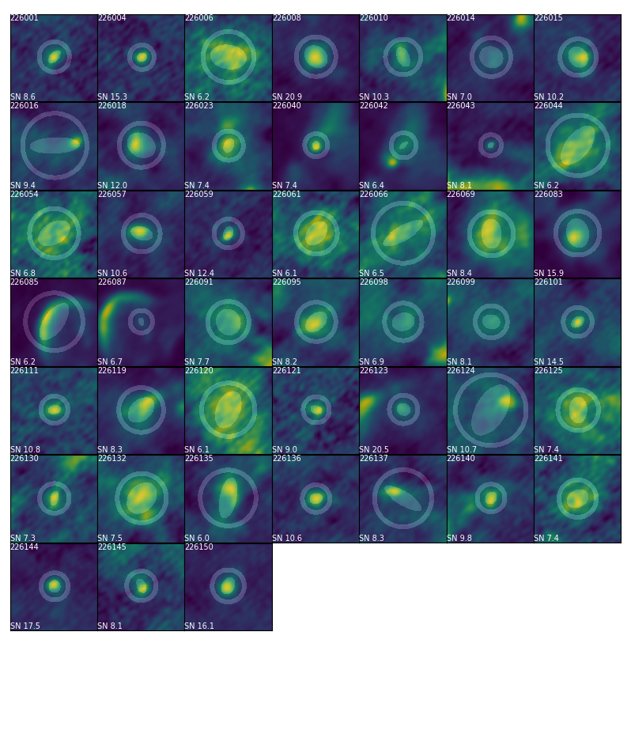

The RadioSource Class
=====================

Initializing a `~dendrocat.RadioSource` object will attempt to extract data from the FITS file header of the image. Since FITS headers vary between telescopes and observations, support for new header formats is added as needed.

Currently, ``dendrocat`` supports FITS header information extraction from the following telescopes:

- EVLA
- ALMA

.. Note:: In a future update, this functionality will be replaced by a ``fitsconfig`` file that will tell the program where to find the information it needs. Users can add to their ``fitsconfig`` to handle unsupported formats.

Manually Setting FITS Header Information
----------------------------------------

If the FITS header is not recognized, the missing attributes will be printed to the console so they can be set manually. Typically, this will include

- ``nu`` : The central frequency of the observation. Specified as a `~astropy.units.quantity.Quantity`.
- ``freq_id`` : A string used to identify different images at a glance. For a 226 GHz observation, for example, the ``freq_id`` could be ``'226.1GHz'``.
- ``metadata`` : Image metadata required for generating a dendrogram.

.. code-block:: python

    # Manually set RadioSource attributes
    import astropy.units as u
    source_object.nu = 226.1*u.GHz
    source_object.freq_id = '226.1GHz'
    source_object.set_metadata()
    
If the wcs, beam, and pixel scale are successfully extracted from the FITS header, after manually setting ``nu`` the method `~dendrocat.RadioSource.set_metadata` can be called to fill in the rest of the metadata.

Custom Dendrograms
------------------

The method `~dendrocat.RadioSource.to_dendrogram` returns a `~astrodendro.dendrogram.Dendrogram` object and adds it as an instance attribute of the `~dendrocat.RadioSource` object.

.. code-block:: python

    >>> source_object.to_dendrogram()
    Generating dendrogram using 738,094 of 49,787,136 pixels (1.4824994151099593% of data)
    [========================================>] 100%
    <astrodendro.dendrogram.Dendrogram at 0x7f00edfe7ac8>
    
    >>> source_object.dendrogram
    <astrodendro.dendrogram.Dendrogram at 0x7f00edfe7ac8>
    
Default dendrogram parameters are produced when the `~dendrocat.RadioSource` object is first initiated. They are based on the standard deviation of pixel values across the whole image, and may need to be adjusted depending on how noisy the image is. 

.. code-block:: python
    
    # Option 1 - Set dendrogram parameters as instance attributes
    import numpy as np
    source_object.min_value = 1.4*np.nanstd(source_object.data)
    source_object.min_delta = 1.2*source_object.min_value
    source_object.min_npix = 10
    custom_dendro = source_object.to_dendrogram()
    
    # Option 2 - Set dendrogram parameters as keyword arguments
    custom_dendro = source_object.to_dendrogram(min_value=1e-4, min_delta=1.5e-4, min_npix=10)
    
Making A Source Catalog
-----------------------

`~dendrocat.RadioSource.to_catalog` returns a source catalog and saves and instance attribute. If this method is called and the `~dendrocat.RadioSource` object has no existing dendrogram, one will be generated using default parameters.

.. code-block:: python

    >>> source_object.to_catalog()
    Computing catalog for 113 structures
    [========================================>] 100%
    <Table masked=True length=113>
    _idx _index _name  ... rejected 226.1GHz_detected
     ...    ...   ...  ...      ...              ...
     
    >>> source_object.catalog
    <Table masked=True length=113>
    _idx _index _name  ... rejected 226.1GHz_detected
     ...    ...   ...  ...      ...              ...

To generate a catalog from a specific `~astrodendro.dendrogram.Dendrogram` object, use the ``dendrogram`` keyword argument.

.. code-block:: python

    >>> custom_dendro = source_object.to_dendrogram(min_value=1e-4, min_delta=1.5e-4, min_npix=10)
    Generating dendrogram using 738,094 of 49,787,136 pixels (1.4824994151099593% of data)
    [========================================>] 100%
    
    >>> source_object.to_catalog(dendrogram=custom_dendro)
    Computing catalog for 113 structures
    [========================================>] 100%
     <Table masked=True length=113>
    _idx _index _name  ... rejected 226.1GHz_detected
     ...    ...   ...  ...      ...              ...
     
Rejection and Plotting Grids
----------------------------

To flag false detections, the `~dendrocat.RadioSource.autoreject` method can be used.

`~dendrocat.RadioSource.plot_grid` displays cutout regions around each of the detected sources, as well as the apertures used to calculate signal-to-noise. Rejected sources show up in grey. 

.. code-block:: python

    >>> source_object.autoreject(threshold=6.)
    >>> source_object.plot_grid(skip_rejects=False)

.. image:: ./_figures/plot_grid_skip_rejects_false.png
    :width: 400
    :alt: A grid of extracted sources from a radio image, showing overlaid elliptical and annular apertures. Some of the squares in the grid are greyed out to represent which sources are rejected.

To display only accepted sources, use the ``skip_rejects`` keyword argument.

.. code-block:: python

    >>> source_object.plot_grid(skip_rejects=True)

